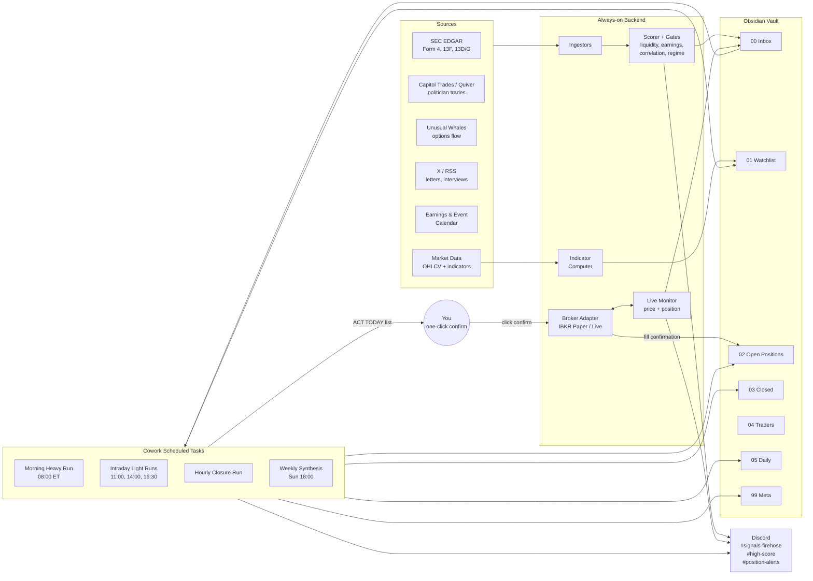

# Bedcrock

A signal-aggregation and analysis system that watches politicians, hedge fund titans, insiders, and options whales; scores trade ideas; runs deep Claude analysis on a schedule; paper-trades them through a broker; and graduates to live capital only after empirical validation.

> [!warning] Not financial advice
> This is a personal research/decision-support system. It is not a registered advisory service. Do not let other people's money ride on it without consulting a securities lawyer in your jurisdiction.

---

## 1. Goals & Non-Goals

**Goals**
- Surface high-signal trade ideas from delayed but reliable disclosures (STOCK Act, 13F, Form 4) and faster sources (options flow, public statements).
- Use Claude (via Cowork) for the heavy reasoning layer four-plus times per day, with always-on infrastructure handling the parts Claude can't.
- Build paper-trading data with the **exact same schema** as live, so the live switch is a config flip, not a rewrite.
- Generate a feedback loop (closure post-mortems, weekly synthesis) that improves the scoring rules over time.

**Non-Goals**
- High-frequency or intraday scalping. The system's edge is days-to-weeks, not seconds.
- Fully autonomous execution. **Human one-click review on every entry is a permanent design feature, not a phase-limited safety wheel.** The bot prepares the order; you confirm it.
- Selling signals to other people. Out of scope; regulatory rabbit hole.

---

## 2. Architectural Principles

These are the invariants. Every component has to respect them or migration breaks.

1. **Paper and live share one data path.** The only difference between paper and live is the broker endpoint and a `mode: paper|live` flag. Everything else — vault layout, Discord channels, Cowork prompts, scoring, schemas — is identical.
2. **Cowork is the reasoning layer, not the infrastructure layer.** Anything that needs to run while your laptop is asleep lives on the always-on backend.
3. **The vault is the source of truth.** Discord and the broker are views on top of vault state, not parallel systems.
4. **Inbox-then-process.** The backend only writes to `00 Inbox/`. Cowork only writes to everywhere else. No write conflicts ever.
5. **Every decision leaves a trace.** Every entry, exit, and skipped signal gets a note. Without traces, the weekly synthesis has nothing to learn from.
6. **Humans confirm entries; machines manage exits.** Bot prepares the bracket order with stop and target attached; you click once to send it. Once filled, server-side OCO at the broker manages the exit even if your VPS dies. This split is intentional: humans are good at sanity-checking but bad at obeying stops, machines are the opposite.

---

## 3. System Map



---

## 4. Phase Gates

Four phases, each with explicit graduation criteria. Don't skip phases. Most of the value of this system comes from the data you accumulate across them.

| Phase | Capital | Duration | Goal | Graduates when… |
|---|---|---|---|---|
| **Paper Phase 1** | $0 (sim) | 4–6 weeks | Plumbing works end-to-end | All components log a full week with no manual fixes; ≥10 closed paper trades |
| **Paper Phase 2** | $0 (sim) | 90 days min | Empirical validation | ≥50 closed trades, Sharpe > 1.0, win rate stable across 4 consecutive 2-week windows, beats SPY on risk-adjusted return |
| **Live Phase 1** | 10–25% of intended size | 60 days min | Real fills, real slippage | Live Sharpe within 30% of paper Sharpe, max drawdown < pre-set limit, no operational incidents |
| **Live Phase 2** | Full size | ongoing | Steady state | Continuous monitoring; revert to Live Phase 1 sizing on any 2-week breach of guardrails |

> [!note] The Sharpe-within-30% rule
> Paper-to-live Sharpe degradation is normal — usually 20–40% — because slippage, partial fills, and overnight gaps that look fine in sim are real losses live. If your live Sharpe is more than 30% worse than paper's, the paper sim is unrealistic, not the strategy. Tighten the slippage model and re-run.

---

## 5. Components

### 5.1 Data Sources

| Source | Latency | Cost | Use |
|---|---|---|---|
| SEC EDGAR (Form 4) | 2 business days | Free | Insider buys/sells — fastest disclosure channel |
| SEC EDGAR (13D/G) | 10 days | Free | Activist stakes |
| SEC EDGAR (13F) | up to 45 days | Free | Hedge fund quarterly snapshots |
| Capitol Trades | 1–45 days | Free (web scrape) | Politician trades |
| Quiver Quantitative | 1–45 days | Paid API | Politician trades + return calc |
| Unusual Whales | real-time | Paid API | Options flow, dark pool |
| X / Twitter list | real-time | Free–paid | Tracked traders' public posts |
| RSS / Substack | real-time | Free | Hedge fund letters, fund manager interviews |
| TradingView alerts | real-time | $15/mo | Per-ticker price triggers |
| **Earnings calendar** | real-time | Free (Nasdaq/Finnhub) | Block/flag entries near earnings |
| **Event calendar** | real-time | Free (FDA, FOMC) | Block/flag entries near scheduled catalysts |
| **OHLCV + indicators** | end-of-day + intraday | Free (Polygon free tier, yfinance) | Pattern/regime layer (§5.8) |
| **News headlines** | real-time | Free (Finnhub/Benzinga RSS) | Sentiment modifier — Phase 2 add |

Pick the cheapest set that covers two faster channels and one slower channel for Paper Phase 1, plus earnings calendar and OHLCV (those two are not optional). Add the rest in Phase 2.

### 5.2 Always-On Backend

**Where it runs:** $5/mo Hetzner or DigitalOcean VPS, Ubuntu 22.04, Python 3.11+. Or a Cloudflare Worker if you want serverless.

**Stack (suggested):**
- `python` + `httpx` for ingestors
- `apscheduler` or systemd timers for polling cadence
- `sqlite` (Phase 1) → `postgres` (Phase 2+) for raw signal storage
- `pydantic` for the signal schema
- `discord-webhook` for posts
- `ib_insync` for broker (paper and live, same adapter)
- `pandas` + `pandas-ta` for indicator computation
- `syncthing` for vault file sync between VPS and your laptop
- `git` cron job for daily vault backup to a private repo

**Responsibilities:**
- Poll each data source at its appropriate cadence (Form 4: every 15 min during market hours; 13F: daily; politician trades: every 30 min; options flow: websocket; earnings calendar: daily at 06:00 ET; OHLCV: end-of-day + on-demand).
- Apply the scoring pipeline (see §8).
- Apply hard gates (see §5.7) before a signal is allowed to escalate to `#high-score` or `ACT TODAY`.
- Compute and cache the indicator/pattern layer (see §5.8) for every ticker in the watchlist.
- Write signal `.md` files into `00 Inbox/`.
- Post to Discord webhooks.
- Run the live monitor (price subscriptions for tickers in `02 Open Positions/`).
- Prepare bracket orders for one-click confirmation (see §5.9).
- Talk to the paper or live broker for fills and position state.

### 5.3 Vault Structure

```
Trading/
├── 00 Inbox/                  # backend writes only
├── 01 Watchlist/              # one note per active candidate
├── 02 Open Positions/         # one note per held position (paper or live)
├── 03 Closed/                 # post-mortems
├── 04 Traders/                # one note per tracked person
├── 05 Daily/                  # Cowork's run outputs
├── 06 Weekly/                 # synthesis notes
├── 99 Meta/
│   ├── scoring-rules.md       # current weights (versioned)
│   ├── watchlist-config.md    # tracked traders, sectors, thresholds
│   ├── risk-limits.md         # position size, drawdown, kill switch
│   └── changelog.md           # every rule change with rationale
└── Templates/                 # frontmatter templates
```

**Frontmatter schemas** — keep these stable across paper and live:

`00 Inbox/` signal file:
```yaml
---
type: signal
status: new          # new | processed | ignored
mode: paper          # paper | live
ticker: NVDA
trader: "[[Pelosi]]"
source: capitol-trades
action: buy
disclosed_at: 2026-05-02
trade_date_range: [2026-04-15, 2026-04-15]
size_range_usd: [50000, 100000]
score: 7.2
score_breakdown:
  cluster: 2.0
  committee_match: 1.5
  size: 1.7
  sector_momentum: 2.0
links:
  source_url: https://capitoltrades.com/...
urgent: false
---
```

`02 Open Positions/` position file:
```yaml
---
type: position
status: open         # open | closed
mode: paper          # paper | live
ticker: NVDA
broker_order_id: ibkr_xxx
entry_date: 2026-05-03
entry_price: 942.15
quantity: 5
size_usd: 4710.75
stop: 866.78
target: 1130.00
thesis_link: "[[01 Watchlist/NVDA]]"
source_signals:
  - "[[00 Inbox/2026-05-02-NVDA-pelosi]]"
  - "[[00 Inbox/2026-04-28-NVDA-form4]]"
---
```

`03 Closed/` post-mortem file: same as position, plus `exit_date`, `exit_price`, `pnl_usd`, `pnl_pct`, `holding_days`, `vs_spy_pct`, `vs_sector_pct`, `close_reason: stop|target|signal_exit|discretionary`.

> [!tip] Why `mode: paper|live` matters
> Every Dataview query, every Cowork prompt, every report filters on this field. When you migrate, you don't change anything about how data is stored — paper and live just live side-by-side and queries pick which to look at. You can even run them in parallel: paper continues validating new rule changes while live runs the validated rules.

### 5.4 Discord

Three channels, one webhook each:
- `#signals-firehose` — every raw signal, low signal-to-noise, browse-only.
- `#high-score` — score ≥ threshold, the channel you actually watch.
- `#position-alerts` — entries, exits, stops hit, urgent events.

A small bot (~80 lines, `discord.py`) handles slash commands:
- `/thesis TICKER` — reads `01 Watchlist/TICKER.md`, posts thesis.
- `/positions` — lists open positions from `02 Open Positions/`.
- `/snooze TICKER 7d` — adds a snooze entry to `99 Meta/snoozed.md` so the scorer ignores that ticker for 7 days.
- `/pnl` — paper-mode equity curve summary.

### 5.5 Cowork Scheduled Tasks

Four scheduled tasks. Keep prompts in `Templates/` so you version them with the rest of the vault.

#### Morning Heavy Run — daily, 08:00 ET (90 min before US open)

```
You are running the morning heavy analysis. Today is {{date}}.

Step 1 — Sweep:
Read every file in ~/Obsidian/Trading/00 Inbox/ where status: new
AND no blocking gate is set. Skip files where gate_blocked: true
unless the gate is overrideable and the override flag is set.
Read all files in 01 Watchlist/ whose frontmatter score changed in the
last 24h. Read 02 Open Positions/ in full.

Step 2 — Regime context:
Fetch overnight ES/NQ futures, Asia and Europe session moves, VIX,
DXY, US 10Y yield, and today's macro calendar (Fed speakers, CPI,
NFP, etc.). Note any events within 48h that could move the book.
Tag the day's market_regime (bull_low_vix | bull_high_vix |
bear_low_vix | bear_high_vix). Write findings to
05 Daily/{{date}}-regime.md.

Step 3 — Per-candidate thesis build:
For each high-score candidate (score >= threshold from
99 Meta/scoring-rules.md), read its indicators block from the
watchlist note. Reject if indicators stale (computed_at > 24h ago).
Write or update 01 Watchlist/<TICKER>.md with: bull case, bear case,
technical levels (use the swing_high_90d / swing_low_90d / SMAs from
the indicators), catalyst calendar 30d out, position sizing relative
to current book (check correlation gate), entry zone (must respect
ATR — stop never tighter than 1.5x ATR_20), invalidation level,
profit targets. Follow [[trader]] wikilinks for context on the
originator's history with this name.

Step 4 — Game plan:
Write 05 Daily/{{date}}-gameplan.md with three sections:
  - ACT TODAY: specific orders for the backend to draft, with size,
    entry zone, stop, target, and the setup tag (breakout | pullback
    | base | mean_reversion | none)
  - WATCH TODAY: price levels that would activate something
  - PASSIVE: no action unless specific event hits

Step 5 — Hand off to backend:
For each ACT TODAY entry, write a corresponding row to
00 Inbox/orders/<id>.md with status: ready_for_draft. The backend
will pick these up, run final gates, construct bracket orders, and
post one-click confirm embeds to #high-score for you to confirm
or skip via Discord.

Step 6 — Mark inbox files processed.
```

#### Intraday Light Runs — daily, 11:00 / 14:00 / 16:30 ET

```
Light intraday check. Today is {{date}}, run at {{time}}.

1. Read 05 Daily/{{date}}-gameplan.md.
2. Check current prices for everything in WATCH TODAY. If any
   level activated, write a brief alert note to 00 Inbox/ flagged
   urgent: true and post to #high-score.
3. Read 00 Inbox/ for new signals since the last run. If any
   has score >= URGENT_THRESHOLD from scoring-rules.md, do a
   compressed thesis build (5-7 sentences) and post to #high-score.
4. Re-check open positions: any approaching stop/target, any news
   in the last 3h. If yes, alert in #position-alerts.
5. Append a short "intraday note" to 05 Daily/{{date}}-intraday.md.

Do NOT rebuild the morning thesis. Do NOT touch closed positions.
Stay light — this run should finish in <5 minutes.
```

#### Hourly Closure Run — hourly, market hours + 1h after

```
Process closure events.

1. Read 00 Inbox/ for files with type: closure and status: new.
   These are written by the live monitor when a paper or live
   position closes.
2. For each, write a post-mortem to 03 Closed/<DATE>-<TICKER>.md
   with the schema in 99 Meta/templates. Include:
   - Entry/exit/pnl
   - Why it worked or didn't (mechanism, not just direction)
   - Original signal predicted vs. actual driver
   - Compare return to SPY and sector ETF over same window
   - One specific lesson (concrete rule change, not vague)
3. If the lesson suggests a scoring weight change, append a
   proposal to 99 Meta/scoring-rules-proposed.md. Do NOT modify
   scoring-rules.md directly — the weekly synthesis adopts proposals.
4. Mark closure inbox files processed.
5. Post a compact summary to #position-alerts.
```

#### Weekly Synthesis — Sunday 18:00 local

```
System-level learning pass.

1. Read every file in 03 Closed/ with exit_date in the last 30 days.
2. Read 99 Meta/scoring-rules.md (current) and scoring-rules-proposed.md
   (proposals from the closure runs).
3. Compute per-trader, per-source, per-sector stats:
   - Win rate
   - Average return
   - Average return vs. SPY
   - Average holding period
   - Sharpe-like ratio
4. Write 06 Weekly/{{date}}-synthesis.md with:
   - Top 3 working signal patterns
   - Top 3 failing signal patterns (candidates for removal/dampening)
   - Whether each proposed rule change in scoring-rules-proposed.md
     is supported by data; for each, recommend ADOPT or REJECT
5. If recommending ADOPT, update 99 Meta/scoring-rules.md, append
   to 99 Meta/changelog.md with rationale, and clear the relevant
   line from scoring-rules-proposed.md.
6. Phase-gate check: read 99 Meta/risk-limits.md and the synthesis
   stats. If we're in Paper Phase 2 and all graduation criteria
   are met (see §4 of system plan), post a "READY FOR LIVE PHASE 1"
   note to #high-score with the supporting numbers.
7. Post a 5-bullet summary of the synthesis to #high-score.
```

### 5.6 Live Monitor

A long-running Python process on the VPS:
- Subscribes to a websocket (Alpaca, Tradier, or Polygon) for tickers in `02 Open Positions/`.
- **Stops and targets are server-side at the broker as OCO bracket orders, not enforced by this monitor.** The monitor *observes*; the broker *enforces*. If your VPS dies overnight, your stops still fire.
- On every tick, updates the position file with the current price and unrealized P&L (so the dashboard is always live).
- On stop or target fill received from broker websocket, writes a closure event to `00 Inbox/` flagged `type: closure`, updates `02 Open Positions/` → moves the file to `03 Closed/`, and posts to `#position-alerts`.
- Re-reads `02 Open Positions/` every 30 seconds so newly-opened positions get monitored automatically.
- Heartbeat: posts a status message to a private `#system-health` channel every 15 min during market hours so you can see it's alive.

### 5.7 Hard Gates

Every signal must pass these gates before it can escalate to `#high-score` or appear in `ACT TODAY`. Gates are *binary* — they don't dampen the score, they block the trade outright. The gate result is logged to the signal frontmatter so the weekly synthesis can ask "did blocked trades have outperformed?"

| Gate | Rule | Override? |
|---|---|---|
| **Liquidity** | 30-day average dollar volume ≥ $5M (paper) / $20M (live) | Never |
| **Earnings proximity** | No entry within 3 trading days of scheduled earnings, before or after | Manual override allowed if thesis explicitly involves the print |
| **Scheduled event proximity** | No entry within 2 trading days of FOMC, CPI, NFP, or known FDA/contract dates for the ticker | Manual override allowed |
| **Correlation** | New position would push portfolio's largest sector concentration over the §10 limit, or correlation to existing book > 0.8 | Reduce size to fit, don't override |
| **Stale signal** | Signal more than 14 days old at first surfacing (handles backlogged disclosures hitting late) | Manual override |
| **Snoozed ticker** | Ticker is in `99 Meta/snoozed.md` | Lift snooze in Discord (`/snooze TICKER 0`) |
| **Daily loss kill switch** | Account at or below the day's loss limit | Resets next session |
| **Open positions cap** | Already at max open positions for the phase | Close something or wait |

The earnings-proximity gate is the one that quietly saves you the most pain. Pelosi buying NVDA the week before earnings is a different trade than buying it in a quiet window — the disclosure didn't tell you which.

### 5.8 Pattern & Indicator Layer

This is **a filter and timing layer, not a signal source.** Don't let it generate trade ideas. Let it sharpen entries, exits, and stops on ideas that already passed the fundamental signal cluster.

**What the backend computes** (cached per ticker, refreshed end-of-day and on-demand during the morning run):

| Indicator | Use |
|---|---|
| 50-day SMA, 200-day SMA | Trend regime: above both = uptrend; below both = downtrend; mixed = chop |
| 20-day ATR | Stop distance and position sizing — never put a stop tighter than 1.5×ATR |
| 14-day RSI | Overbought/oversold context, not a signal |
| 30-day IV percentile | Volatility regime; affects size and option strategy if used |
| 30-day average dollar volume | Liquidity gate input |
| Relative strength vs. SPY (60-day) | Is the name leading or lagging the market |
| Relative strength vs. sector ETF (60-day) | Is the name leading or lagging its peers |
| 20-day high / 20-day low | Breakout / breakdown reference levels |
| Recent swing levels (last 90 days) | Support and resistance for entry zones and stops |

These are written into the watchlist note's frontmatter, so Cowork sees them as structured data, not raw OHLCV:

```yaml
indicators:
  trend: uptrend
  price: 942.15
  sma_50: 901.20
  sma_200: 820.40
  atr_20: 28.50
  rsi_14: 62
  iv_percentile_30d: 38
  adv_30d_usd: 412_000_000
  rs_vs_spy_60d: 1.18      # outperforming SPY by 18% over 60d
  rs_vs_sector_60d: 1.05
  swing_high_90d: 974.00
  swing_low_90d: 768.00
  setup: pullback_to_50sma  # one of: breakout, pullback, base, none
```

**What Cowork does with them.** The morning prompt asks Claude to interpret these in context: is the entry zone a sensible level given the swing structure, does the 1.5×ATR stop give the trade room without risking too much, is the relative strength supportive of the thesis. Claude *interprets*; it doesn't compute. The numbers come from the backend.

**What's deliberately excluded.** Candlestick pattern catalogs, Fibonacci retracements, Elliott Wave, multi-indicator crossover systems. These have weak empirical support as standalone alpha and would dilute the system's actual edge (the signal cluster). Resist adding them.

**Setup tagging.** The closure post-mortem records which setup type was active at entry (`breakout`, `pullback`, `base_breakout`, `mean_reversion`, `none`). After ~30 closed trades the weekly synthesis can answer "do my breakout entries outperform my pullback entries on the same fundamental signals?" — which is the actually useful pattern question.

### 5.9 Order Execution — One-Click Confirm Flow

The execution layer is deliberately split so the human is the trigger, but never has to babysit risk management once the order is live.

**Step-by-step:**

1. **Cowork morning run** writes `ACT TODAY` to `05 Daily/<date>-gameplan.md` and posts the list to `#high-score` with one Discord embed per candidate.
2. **Backend prepares draft bracket orders.** For every `ACT TODAY` row, the backend constructs a complete bracket order in memory (limit entry, OCO stop and target attached, calculated quantity, all gate checks passed) and writes a draft order file to `00 Inbox/orders/<id>.md` with status `draft`. It does *not* send it to the broker yet.
3. **Discord prompt to you.** The `#high-score` embed for each candidate has the full order preview (entry, stop, target, size, %risk, gate results) and a clear path to confirm. Two ways to confirm:
   - **Slash command in Discord:** `/confirm <id>` — bot reads the draft, sends the bracket to the broker, updates the order file to `status: sent`.
   - **Tap-friendly mobile:** the embed includes a deep link `claude-trade://confirm/<id>` that opens a tiny local web UI showing the order, with a single "Send to broker" button. Built once, takes ~2 hours to set up. Best on phone — tap it from bed at 8:15 ET, done.
4. **Broker fills**, websocket fires, live monitor catches it, position file written, `#position-alerts` ping. From this moment on, the OCO at the broker manages the exit. You don't have to do anything until close.
5. **Skipping a trade is also one click.** `/skip <id> reason: earnings-too-close` writes `status: skipped` and the reason to the order file. Skipped orders feed the weekly synthesis the same as taken ones — "would I have made money on the trades I skipped?" is one of the most useful questions the system can answer.

**Default order type:** marketable limit at entry zone midpoint + OCO stop + target. Not market orders — they slip on news. Not pure limits at the bottom of the entry zone — they don't fill on momentum.

**Time-in-force on the entry limit:** Day order. If it doesn't fill by close, the draft expires and Cowork re-evaluates tomorrow. Don't let stale entries linger — the signal context decays fast.

**What the bot will *never* do without a click:**
- Open a new position
- Add to an existing position
- Reverse a position
- Lift the daily kill switch
- Override a hard gate

**What the bot *will* do without a click:**
- Trail or move stops *only if* the position file's `auto_trail` flag is true and the rule is in `99 Meta/risk-limits.md` (e.g., "move stop to break-even after +1R"). Default off; you turn it on per-position.
- Close at stop or target via the pre-set OCO at the broker. (This isn't really the bot acting — the broker enforces; the bot just records.)
- Cancel stale draft orders at end of day.
- Hit the daily kill switch on -2% drawdown.

---

## 6. Paper Trading & Broker Choice

### 6.1 Broker Recommendation

**Paper:** Alpaca Paper. Free, US equities + options, REST + websocket, identical API to live Alpaca. Fractional shares supported. Set up in 10 minutes. The only code that changes for migration is the API key and base URL.

**Live (US equities) — three options, ranked:**

| Broker | Best for | Pros | Cons |
|---|---|---|---|
| **Alpaca Live** ⭐ | Live Phase 1, probably Phase 2 | Same API as paper (zero migration friction); $0 commissions; native bracket/OCO orders; clean websocket | Routing is okay not great; PFOF means not best-fill on every order. For tickets <$10k you won't notice |
| **Tradier** | Active options trading; tickets >$25k | Better fills than Alpaca, especially options; $10/mo flat or per-contract | A few hundred lines of adapter code to migrate |
| **Interactive Brokers** | Books >$250k; international | Best execution by a wide margin; cheapest at scale; international markets | API everyone hates (TWS/Gateway desktop kludge or rate-limited Client Portal); overkill below $250k |

Default path: **Alpaca paper → Alpaca live → consider Tradier only if options trading scales up.**

### 6.2 Order Mechanics

Every entry is a **bracket order**: limit entry + OCO (one-cancels-other) stop loss + take profit. Sent in a single API call, atomic at the broker. This is why Alpaca's native bracket support matters — you don't want to manage three separate orders and hope they stay in sync.

The execution flow (from §5.9, restated for completeness):

1. Cowork's morning gameplan lists the candidate.
2. Backend constructs the full bracket draft, runs all gates, writes it to `00 Inbox/orders/<id>.md` as `status: draft`. Discord posts the preview embed to `#high-score`.
3. **You click confirm** — `/confirm <id>` in Discord, or tap the deep link to the local web UI. One action, no fields to fill.
4. Backend sends the bracket to the broker. Single atomic API call.
5. Broker fills the entry; OCO sits server-side and will fire on stop or target *even if your VPS is offline*.
6. Live monitor observes the fill via websocket, writes the position file, posts to `#position-alerts`.

### 6.3 Slippage Model

Don't take mid-price as your fill in paper. Realistic assumptions:

- Limit orders: fill only if price *crosses through* your limit by at least 1bp during the bar; assume 50% fill probability if it just touches.
- Market orders (used only for closes if OCO doesn't fire): fill at ask + 5bps (buy) or bid - 5bps (sell), plus 2bps for assumed market impact on size > $5k.
- For tickers with 30-day ADV below 500k shares: halve simulated fill size and add 10bps slippage.

Adjust these constants in `99 Meta/risk-limits.md` after Live Phase 1 based on observed slippage. The point is to make paper *pessimistic*, not optimistic — you want live results to surprise you positively, not the other way around.

### 6.4 Equity Tracking

Starting paper equity: **$100k**. Don't match it to your intended live size — you're testing the strategy, not the size. Sizing scales with equity in both modes via the `risk-limits.md` percentages.

Backend writes daily equity snapshots to `99 Meta/equity-curve.csv`:

```csv
date,mode,equity,cash,positions_value,daily_pnl,daily_pnl_pct
2026-05-03,paper,100000.00,100000.00,0.00,0.00,0.00
2026-05-03,live,25000.00,25000.00,0.00,0.00,0.00
```

Sharpe, drawdown, and phase-gate calculations read from this CSV. Once live is running, paper continues in parallel for at least 30 days so you have a head-to-head comparison.

### 6.5 The "Do Nothing" Baseline

Run a parallel paper portfolio that just buys SPY equal-weight every time the system would have entered. Same sizing, same hold periods, same exits driven by SPY's behavior on those dates. Track its equity curve in `99 Meta/equity-curve.csv` with `mode: baseline`. If your system's risk-adjusted return doesn't beat this baseline net of stress and effort, that's important to know early — and you'll only know if you tracked it from day one.

---

## 7. Data Captured Per Trade (the Migration Schema)

Every closed trade — paper or live — has these fields. Identical schema is what makes migration painless.

```yaml
ticker: NVDA
mode: paper                  # only field that differs at migration
entry_date: 2026-05-03
entry_price: 942.15
exit_date: 2026-05-21
exit_price: 1108.40
quantity: 5
holding_days: 18
pnl_usd: 831.25
pnl_pct: 17.65
fees_usd: 0.00               # paper = 0; live = real commissions

# Benchmarking
spy_return_pct: 1.8
sector_etf: SMH
sector_return_pct: 4.2
excess_vs_spy_pct: 15.85
excess_vs_sector_pct: 13.45

# Attribution
source_signals: [...]
score_at_entry: 7.2
score_breakdown_at_entry: {...}
trader_primary: "[[Pelosi]]"

# Pattern/regime context at entry
setup: pullback_to_50sma     # breakout | pullback | base | mean_reversion | none
trend_at_entry: uptrend      # uptrend | downtrend | chop
atr_at_entry: 28.50
iv_percentile_at_entry: 38
rs_vs_spy_at_entry: 1.18
rs_vs_sector_at_entry: 1.05
market_regime: bull_low_vix  # bull_low_vix | bull_high_vix | bear_low_vix | bear_high_vix
days_to_earnings_at_entry: 21

# Execution quality
slippage_entry_bps: 4.2
slippage_exit_bps: 6.1
fill_quality: good           # good | acceptable | poor
broker: ibkr

# Outcome
close_reason: target_hit
thesis_held: true            # did the original mechanism actually drive the move?
notes: "..."
```

The weekly synthesis aggregates these across `mode: paper` for paper performance and `mode: live` for live performance. When you graduate to live, the same Dataview queries just start returning live data alongside paper.

---

## 8. Scoring & Filtering

**Initial scoring (Paper Phase 1 starting weights):**

| Component | Range | Notes |
|---|---|---|
| Cluster (multiple traders, same ticker, 30d) | 0–3 | +1 per additional independent source after the first |
| Committee/sector match | 0–2 | Lawmaker on Armed Services buys defense → +2 |
| Position size relative to trader's typical | 0–2 | Within 90th percentile of their size → +2 |
| Insider buy corroboration (Form 4) | 0–2 | Cluster insider buy in same 30d window |
| Options flow corroboration | 0–2 | Unusual call sweeps in same direction in 14d |
| Trader's own track record | -1 to +2 | Long-term win rate, applied as multiplier or bonus |
| Public statement alignment | 0–1 | Trader on TV/letters confirming thesis |
| **Trend regime alignment** | -1 to +1 | Long signal in uptrend +1; long signal in downtrend -1 |
| **Relative strength** | 0–1 | RS vs. sector > 1.0 → +1 |
| **News/sentiment (Phase 2 only)** | -2 to +1 | Negative news 48h: -2; corroborating positive news: +1 |
| **Regime overlay** | -1 to +1 | Set per-source per-regime; e.g., insider buys do better in drawdowns: +1 when SPY -10% off highs |

Threshold for `#high-score`: 5.0 (Phase 1) — tune from data in Phase 2.
Threshold for "ACT TODAY": 7.0 (Phase 1).
Urgent threshold for intraday: 8.0.

**Hard gates from §5.7 are applied after scoring.** A signal can have a score of 9 and still be blocked by the earnings-proximity gate. Blocked signals are logged with their score and the gate that blocked them, so the weekly synthesis can validate the gates.

All thresholds and weights live in `99 Meta/scoring-rules.md`. Every change goes through the proposed → adopted flow in §5.5 so you have a changelog.

---

## 9. Migration Criteria — Paper to Live

The weekly synthesis checks these every Sunday. **All** must be true.

- [ ] At least 90 calendar days in Paper Phase 2.
- [ ] At least 50 closed trades (across paper).
- [ ] Sharpe ratio > 1.0 over the full Phase 2 period.
- [ ] Win rate stable: standard deviation of win-rate across 4 consecutive 2-week buckets < 10 percentage points.
- [ ] Average excess return vs. SPY > 0 over Phase 2.
- [ ] Max drawdown < 15% of starting paper equity.
- [ ] No more than 1 operational incident in the last 30 days (failed run, missed signal, mis-fill, etc.) and incident count trending down.
- [ ] At least 3 of the tracked signal types each have ≥ 10 closed trades (so per-type stats are real, not noise).
- [ ] Weekly synthesis has adopted at least 2 rule refinements (proves the feedback loop works).

> [!warning] Don't game the criteria
> If you find yourself tweaking a stop level to nudge the Sharpe over 1.0 in week 12, you've already failed the test. The criteria are guardrails for *you*, not for the system.

---

## 10. Risk Management (Live)

These bind from Live Phase 1 onward. Paper has no real risk but you should still simulate them so the muscle memory exists.

| Limit | Live Phase 1 | Live Phase 2 |
|---|---|---|
| Per-trade size | 1% of equity | 2% |
| Per-position size | 3% of equity | 5% |
| Per-sector concentration | 15% | 25% |
| Open positions max | 8 | 15 |
| Daily loss kill-switch | -2% of equity | -3% |
| Weekly loss → revert phase | -5% | -7% |
| Max correlated exposure | 0.7 portfolio beta | 1.0 |

The live monitor enforces the kill switch: at -2% on the day, it cancels open orders and refuses new entries until next session. Cowork still does its analysis runs but flags everything as `acted: false` in the position frontmatter.

---

## 11. Build Order

Don't try to build everything in week one. The order matters because each step de-risks the next.

**Week 1 — Skeleton.**
Vault structure, frontmatter templates, Discord webhooks, one ingestor (Capitol Trades or SEC Form 4), backend writes to `00 Inbox/`. **Add the earnings calendar ingestor and OHLCV fetcher in this same week** — they're cheap and needed by the gates. Daily git backup of vault. End-to-end signal flowing into the vault and into Discord. No Cowork yet.

**Week 2 — Cowork morning run + indicator layer.**
Backend computes indicators (§5.8) and writes them to watchlist frontmatter. Morning heavy run consumes them. Generate hypothetical game plans without placing orders. Build feel for prompt quality.

**Week 3 — Alpaca paper integration + one-click confirm + live monitor + hard gates.**
Bracket order construction, draft order writing, Discord `/confirm` slash command, one-click web UI (or skip the UI for now and use only Discord). Live monitor observes fills via websocket. Hard gates from §5.7 wired in. Closure run added. SPY baseline portfolio starts tracking. **End of Paper Phase 1 starts here.**

**Weeks 4–6 — Add ingestors and tune.**
13F (WhaleWisdom or 13F.info), more Form 4 coverage, options flow if you have UW, X list. Add the intraday light runs. Tune scoring weights manually as you see signal quality. Hit the Phase 1 graduation criteria (10+ closed paper trades, plumbing stable for a week, baseline tracking).

**Weeks 7–18 — Paper Phase 2.**
Weekly synthesis runs. Don't add new sources unless one is clearly missing. Add news/sentiment modifier mid-Phase 2 if a clear gap shows up in the data. Focus on rule refinements via the proposed/adopted loop. Hit migration criteria.

**Weeks 19+ — Live Phase 1, then 2.**
Migrate broker config, keep paper running in parallel for 30 days minimum. Compare paper vs. live Sharpe weekly.

> [!tip] Resist mid-build scope creep
> The temptation to add "just one more source" or "just one more rule" before Phase 2 is enormous and almost always wrong. The system needs *closed trade data* to learn, and you only get that by running it as-is for 90+ days.

---

## 12. Failure Modes & Mitigations

| Failure | Mitigation |
|---|---|
| Cowork run fails silently (laptop asleep) | Backend pings `#high-score` if no run output appears in `05 Daily/` within 30 min of scheduled time |
| Backend crashes overnight | systemd auto-restart + healthcheck endpoint + Discord ping on restart |
| Vault sync conflict | Inbox-then-process pattern (§2.4) prevents this by design; if it ever happens, Cowork's prompt rejects the run and pings you |
| Vault corruption / lost | Daily `git commit` of the vault to a private repo via cron; full recovery by clone |
| Broker API outage during live monitor | Live monitor caches last known prices, refuses to open new positions, alerts to `#position-alerts`; existing stops handled by broker-side OCO orders |
| Signal source goes quiet (scraper breaks) | Per-source heartbeat; if no signals from source X in N hours during market hours, Discord alert |
| Scoring drift (rules change too fast) | Hard-cap: max one weight change per weekly synthesis. Changelog reviewed before any live phase advance |
| Overfitting to paper | The 30%-Sharpe-degradation guardrail in §4 catches this; if breached, drop back to Live Phase 1 sizing and re-run paper for 4 weeks |
| Stale indicator cache | Backend stamps every indicator block with `computed_at`; Cowork prompt rejects watchlist entries whose indicators are >24h old and re-fetches |
| Stale draft order never confirmed | Drafts auto-expire at end of regular session; Discord summary lists what was skipped vs. expired |
| Travel / timezone confusion | Backend and all scheduled tasks anchor to ET regardless of laptop TZ; phone reminders sent in your local TZ separately |
| Earnings/event calendar miss | Gates fail-closed — if the earnings API call fails, the gate blocks the trade rather than passing it. Manual override available |
| OCO not supported on a fill | Backend rejects the entry if it can't attach the bracket; logs to `#position-alerts` |

---

## 13. Out of Scope (for now)

- Crypto. Different infra, different exchanges, different signal sources.
- Options trading by you (you can still *use* options flow as a signal). Options sizing/Greeks add a whole risk layer.
- International equities. ADRs are fine; native foreign listings aren't.
- Selling signals or letting others trade off your system.
- Tax optimization (wash sales, lot accounting). Real concern for live but a separate workstream.

---

## 14. Caveats

- Past returns of any tracked trader do not predict their future returns. Survivorship bias is rampant in published "copy Buffett" results.
- The 45-day disclosure delay for STOCK Act and 13F is a structural problem. The system mitigates it via faster corroborating signals and theme-trading, not by pretending the delay isn't there.
- Paper-trading P&L is *always* better than live. Plan for it.
- This document is a starting point. Treat `99 Meta/changelog.md` as the canonical record once the system is running — this plan is just the bootstrap.

---

## Appendix A — Dataview Queries

Drop these into a dashboard note (`Dashboard.md`) for live system state.

**Active high-score watchlist:**
````dataview
TABLE ticker, score, trader, disclosed_at
FROM "00 Inbox"
WHERE type = "signal" AND status = "new" AND score >= 5
SORT score DESC
````

**Open paper positions:**
````dataview
TABLE ticker, entry_date, entry_price, stop, target
FROM "02 Open Positions"
WHERE status = "open" AND mode = "paper"
SORT entry_date DESC
````

**Last 30 days closed paper trades:**
````dataview
TABLE ticker, pnl_pct, excess_vs_spy_pct, close_reason, holding_days
FROM "03 Closed"
WHERE mode = "paper" AND exit_date >= date(today) - dur(30 days)
SORT exit_date DESC
````

**Per-trader paper performance:**
````dataview
TABLE
  length(rows) as trades,
  round(sum(rows.pnl_pct) / length(rows), 2) as avg_pnl,
  round(sum(rows.excess_vs_spy_pct) / length(rows), 2) as avg_excess
FROM "03 Closed"
WHERE mode = "paper"
GROUP BY trader_primary
SORT avg_excess DESC
````

---

## Appendix B — File Naming Conventions

- Inbox signals: `00 Inbox/YYYY-MM-DD-TICKER-source.md` (e.g. `2026-05-02-NVDA-pelosi.md`)
- Watchlist: `01 Watchlist/TICKER.md` (one per ticker, gets updated)
- Open positions: `02 Open Positions/TICKER-YYYY-MM-DD.md`
- Closed: `03 Closed/YYYY-MM-DD-TICKER.md` (date is exit date)
- Daily: `05 Daily/YYYY-MM-DD-{regime|gameplan|intraday}.md`
- Weekly: `06 Weekly/YYYY-MM-DD-synthesis.md` (date is the Sunday)

Stable names matter because the Cowork prompts reference paths directly. Don't rename folders without updating prompts and Dataview queries.
